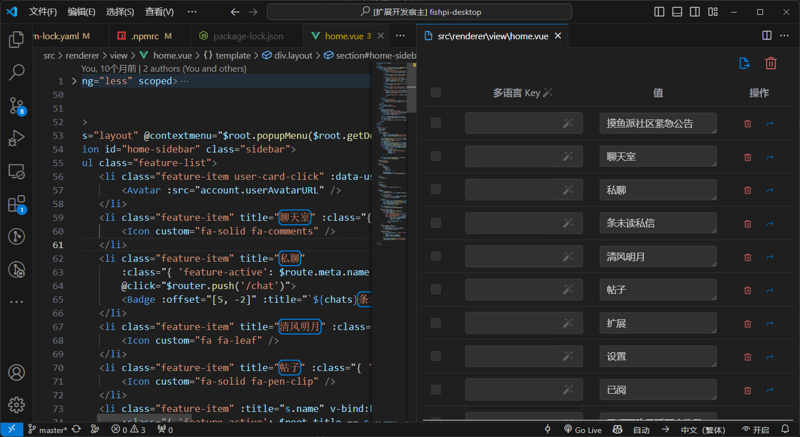

  

<h1 align="center">Vue 国际化开发助手</h1>

本插件用于 Vue 项目添加国际化支援辅助开发之用。可以快速为项目添加国际化支援，同时提供了国际化的翻译功能。

## ✨ 功能

1. 识别 Vue 文件中的中文文本；
2. 自动生成 key；
3. 生成翻译文件；
4. 导出翻译结果；

## 💻 使用

1. 打开 Vue 文件，点击右上角的自动识别中文：  
     
2. 稍等片刻，待其识别完成后，会打开编辑界面：  
     
3. 确认 Vue 文件是否还有遗漏的需翻译的中文字符串。如果有，则选中后点击浮窗的`添加到多语言`：  
      
4. 对于不需要翻译的位置，鼠标移动到翻译项位置，点击出现的 `移除翻译位置` 即可：  
     
5. 添加完成后，点击`多语言 Key`后的按钮`自动生成`。自动生成多语言 Key：  
     
6. 点击操作的删除按钮可以删除多语言项目，跳转按钮可以跳转到多语言的行。  
        
7. 最后，点击`导出`按钮，弹出的文件夹选择框选择导出的目的地。确定后就会开始导出，同时会将多语言 Key 使用 `$t('key')` 插入到代码中，只要再在代码中加入实现或导入 `$t` 函数即可。  
     
      

## 📦 配置

插件的配置项如下：
- `vue-i18n.appId`: 百度翻译接口 appId，若不设置则无法自动生成 Key 与自动翻译导出结果。申请方法见[百度翻译文档](http://api.fanyi.baidu.com/product/113)
- `vue-i18n.appKey`: 百度翻译接口 API Key，若不设置则无法自动生成 Key 与自动翻译导出结果。申请方法见[百度翻译文档](http://api.fanyi.baidu.com/product/113)
- `vue-i18n.i18nFunctionName`: 插入到代码的 i18n 函数名，默认为 `$t`。
- `vue-i18n.autoTranslateResult`: 是否自动翻译导出结果，默认为 `false`。
- `vue-i18n.exportLanguageExcel`：是否导出翻译结果 Excel，默认为 `false`。
- `vue-i18n.languages`: 导出的语言列表，支援的语言列表见[百度翻译文档](http://api.fanyi.baidu.com/product/113)。默认为 `['en']`。

## ⚙️ 调试

若有更新维护，需要调试代码，可以按照以下步骤进行：

1. 安装依赖：`npm install`
2. 终端执行 `npm run dev`
3. 按下 `F5` 即可调试。

extension 的代码可以直接下断点调试。

Webview 代码则在启动的 `扩展开发宿主` 按下 `Ctrl + Shift + I` 启动开发者工具调试。

启动开发者工具后，可按下 `Ctrl + Shift + C` 选择要调试的Webview。然后切换到 `Console` 选项卡，查看 Webview 的 id：  
  

然后切换到 `Source` 选项卡。在左侧的文件列表中该 id 目录，展开找到 `localhost:5173` 即可对 Webview 代码下断点调试。  
  

## 📄 Release Notes

### 0.0.1

- 初版发布。

